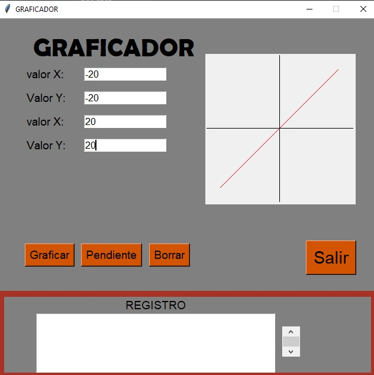

## PARCIA FINAL
Un profesor de matematicas requiere una herramienta que permita graficar una linea recta en el palno cartesiano dado los puntos (x,y)pertenecientes a dicha recta igualmente,que calcule su pendiente,la app inicie monstrando el plano cartesiano con sus respectivos ejes y origen.asi como cuatro campos de texto para ingresar los valores de x e y,de las dos puntos de la recta,debe existir un widget por medio del cual se genere un evento para graficar la linea,asi como para calcular y monstrarel valor de la respectivapendiente

